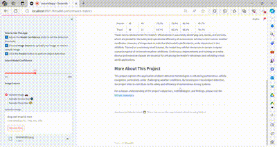

# Object Detection for Autonomous Vehicles in Inclement Weather

## Project Overview

This project showcases the application of the YOLOv8 model for object detection, tailored for enhancing the perception capabilities of autonomous vehicles under inclement weather conditions. Our solution focuses on accurately recognizing critical objects such as cars, trucks, and pedestrians, ensuring safety and efficiency in autonomous vehicle navigation despite challenging visibility and sensor performance hurdles posed by adverse weather.

## Demo Video



## Try it Yourself!

Experience the app firsthand:

[](https://object-detection-demoo.streamlit.app/)

Click [here](https://object-detection-demoo.streamlit.app/) to try the app!

## Deployment Instructions

To deploy this Streamlit app using our repository, follow these steps:

### Prerequisites

Before you begin, ensure you have met the following requirements:

- **Git**: For cloning and managing versions of the repository.
- **Python**: The project is tested with Python 3.9. Adjust according to your project's compatibility. It's recommended to use a virtual environment.
- **pip**: To install Python packages listed in `requirements.txt`.

Please refer to `requirements.txt` for the Python packages and their versions needed to run this application.


### Steps

1. **Clone the Repository**

   Clone this repository to your local machine using Git:

   ```bash
   git clone https://github.com/RafaelaMartelo/object-detection-demo.git
   cd your-repo-name

2. **Create a Virtual Environment**

   ```bash
   python3 -m venv venv
   source venv/bin/activate  # On macOS/Linux
   .\venv\Scripts\activate  # On Windows

3. **Install Dependencies**

   Install the project's dependencies by running:

   ```bash
   pip install -r requirements.txt

4. **Run the App Locally**

   With the dependencies installed, you can run the app locally by executing:

   streamlit run object_detection_demo.py

   Your default web browser should automatically open a new tab pointing to localhost:8501, where you can interact with your Streamlit app.

5. **Deploying on Streamlit Sharing**

   - Ensure you have a `requirements.txt` file and a `packages.txt` file (if necessary for system-level packages) in your repository.
   - Log in to your Streamlit Sharing account or sign up if you don't have one.
   - Once logged in, go to your apps dashboard and click on 'New app'.
   - Select the GitHub repository where you've pushed your app, choose the branch where the app is located, and then enter the path to your app's file (`object_detection_demo.py`).
   - Click 'Deploy', and Streamlit Sharing will start the process of deploying your app. After a few moments, you should be provided with a URL to access your deployed app.

**Note**: The deployment process on Streamlit Sharing automatically installs Python dependencies listed in your `requirements.txt` file. If your app requires system-level packages, make sure to include a `packages.txt` file in your repository root with the required system packages listed there. Streamlit Sharing will install these system-level packages before running your app.

## More About this Project

For more details on the project's techniques, methods, or dataset, please see the following related repository:

- [Capstone_Object_Tracking_and_Detection_for_AV](https://github.com/RafaelaMartelo/Capstone_Object_Tracking_and_Detection_for_AV)

This repository includes additional documentation, datasets, and code used on the Deep Learning model development that complement the current project.

## Contributors

- Rafaela Martelo - [rafaelasofialm98@gmail.com](mailto:rafaelasofialm98@gmail.com)

## License

This project is licensed under the MIT License.

## Acknowledgments

This demo App was was developed upon the [hello-streamlit](https://github.com/streamlit/hello-streamlit) sample provided by Streamlit. 
